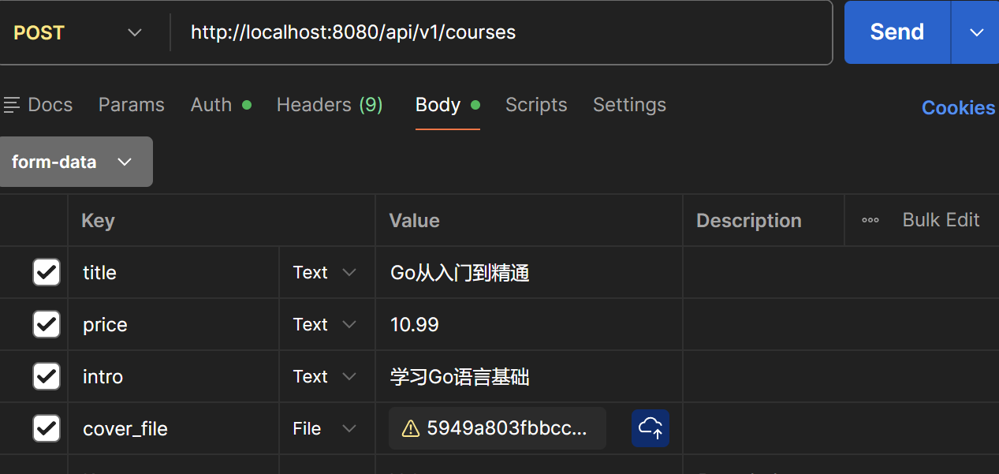

# 在线视频学习平台（geekedu-project）

## 项目介绍
基于微服务架构的在线视频学习平台，核心实现付费视频的OSS权限控制与分发。

## 环境准备
1. 安装Docker、Docker Compose
2. 开通阿里云OSS，创建私有Bucket，获取AccessKey ID/Secret、Endpoint、Bucket名称

## 何配置 OSS Key
1. 在阿里云 OSS 控制台创建或使用已有 Bucket，并且设置为私有。
2. 获取 `AccessKey ID` 与 `AccessKey Secret`。
3. 在部署目录 `deploy` 下创建 `.env` 文件，提交到仓库
具体相关密钥在上面写了，并且geekedu-project\deploy\.env文件夹下就是该配置文件

## 如何启动项目
我用的是docker，所以直接cd geekedu-project/deploy,然后docker-compose up --build -d，弄完了后再docker-compose down关闭即可，然后相关的post、get测试可以在postman完成，注册、登录、发布课程、购买、播放
具体的话，就是
首先可以在postman注册两个用户，一个管理员admin，一个学员student,用POST http://localhost:8080/api/v1/auth/register，Body raw JSON。比如
{
  "username": "ming",
  "password": "123456",
  "role": "admin"
}
然后就可以登录了，两个用户都登陆，POST http://localhost:8080/api/v1/auth/login，Body raw JSON，登录并获取 Token
，然后就会得到一个Authorization: {{token}}，记住token就行，比如
{
  "username": "ming",
  "password": "123456"
}

可以查看一下课程列表，GET http://localhost:8080/api/v1/courses，当然最开始什么都没有

接下来使用管理员账号，发布课程
POST http://localhost:8080/api/v1/courses
Headers: Authorization: {{token}}
Body → form-data:
title = "示例课程"
price = "10"
intro = "课程简介"
cover_file = (选择本地图片)

然后就会返回一个course_id，这是课程id

接下来可以上传视频
POST http://localhost:8080/api/v1/courses/{{course_id}}/videos
Body form-data: video_file (选择本地 mp4)
然后就会返回一个video_id

接下来切换学员账号，登录，跟上面一样，然后可以购买
POST http://localhost:8080/api/v1/orders
Body raw JSON：
{"course_id":填之前发布的课程id}
这样可以购买

接下来是观看，
GET http://localhost:8080/api/v1/player/{{video_id}}
需要Headers: Authorization: {{token}}，就是学员登录token信息
然后会返回一个链接，复制网址打开，可下载看视频

具体相关演示会上传视频
