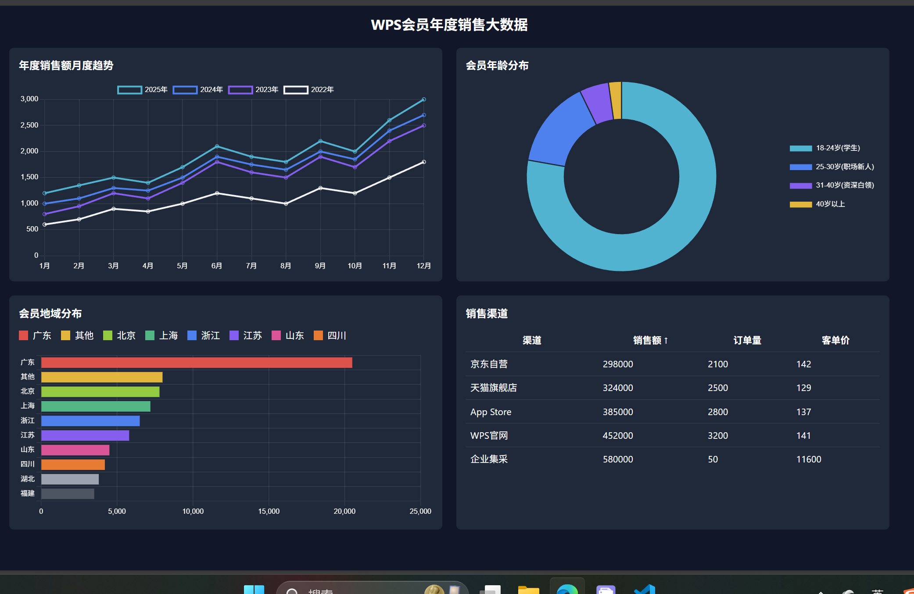

此目录存放本周课后作业，可以在此文件添加作业设计思路和流程图等

以上是最终网站图，然后提交的时候
因为我做了一些安装操作
npx create-react-app . --template typescript
npm install chart.js react-chartjs-2
npm install tailwindcss@3 postcss autoprefixer
npx tailwindcss init -p
然后生成了许多包文件，其中就有node_modules文件夹，里面是一些项目组件之类的
这个我传不到WPS我的个人项目库里面
我不清楚是怎么检测代码的
但那个项目库里面的结构是不完整的，得重新创建react，来获得这些组件